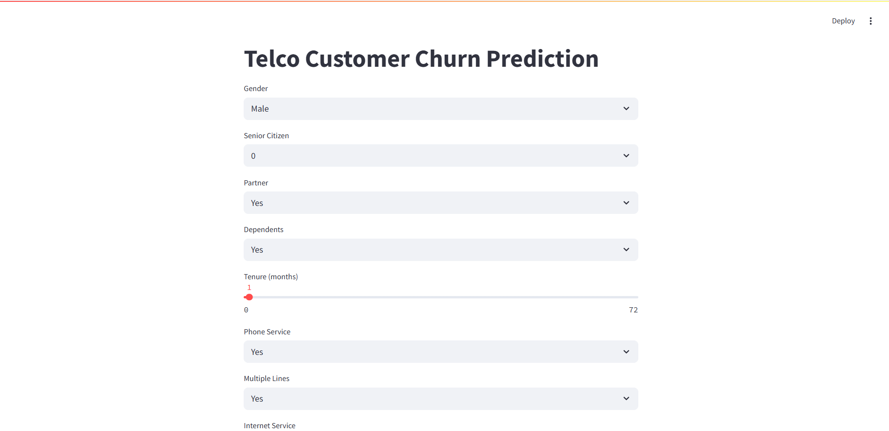

# Churn Prediction — Machine Learning Classification

* Churn Prediction using Machine Learning to identify customers likely to leave a service, built with scikit-learn, Streamlit, and Pandas.


---

# Table of Contents

- [Churn Prediction — Machine Learning Classification](#churn-prediction--machine-learning-classification)
- [Table of Contents](#table-of-contents)
- [Project overview](#project-overview)
- [Files \& repo structure](#files--repo-structure)
- [Steps to understand the project](#steps-to-understand-the-project)
- [Why this is a classification problem](#why-this-is-a-classification-problem)
- [Setup \& requirements](#setup--requirements)
- [How to run (development \& inference)](#how-to-run-development--inference)
  - [1) Inspect \& run notebook (Colab or locally)](#1-inspect--run-notebook-colab-or-locally)
  - [2) Run the Streamlit app](#2-run-the-streamlit-app)
- [Contributing](#contributing)


---

# Project overview

**What is churn?** Churn means a customer stops using or paying for a product/service (e.g., cancels subscription, closes an account). The goal of this project is to **predict which customers are likely to churn** so the business can proactively reduce churn.

This repository contains a full pipeline: dataset, model training notebook, a persisted model file, and a Streamlit interface to test predictions interactively.

---

# Files & repo structure

```
├─ README.md                    # (this file)
├─ WA_Fn-UseC_-Telco-Customer-Churn.csv  # dataset file (raw)
├─ customer_churn_classification.ipynb   # model building & EDA (Colab-friendly)
├─ churn_model.pkl               # trained model artifact (joblib / pickle)
├─ churnModel.py               # Streamlit app for interactive predictions
└─ requirements.txt             # dependencies for one-command install
```


# Steps to understand the project

Read and run the files in this order to understand how everything fits together:

1. **Open the dataset** (`WA_Fn-UseC_-Telco-Customer-Churn.csv`) — inspect columns, missing values, types and distribution. This step is EDA (Exploratory Data Analysis).
2. **Run `customer_churn_classification.ipynb`** — the notebook contains step-by-step code for:

   * Data cleaning and handling missing values.
   * Encoding categorical features and scaling numeric features.
   * Feature selection / engineering.
   * Train-test split and model training
   * Model evaluation:
   * Model persistence saved as `churn_model.pk`).


3. **Launch the Streamlit app** (`churn_model.py`) — the app loads `churn_model.pk`, accepts user inputs (drop-downs / numeric fields), applies the same preprocessing, and returns churn prediction and probability. This allows quick manual testing of model behavior.
4. **Evaluate & iterate** — if metrics are unsatisfactory, revisit the notebook: try different features, tune hyperparameters, or test different models.

---

# Why this is a classification problem

* The target variable (`Churn`) is categorical ( binary: **Yes** / **No** or `1` / `0`).
* Tasks where the model must choose a **category** (class) for each example are classification tasks.
* You train a classifier to map customer features (usage, demographics, contract type, tenure, charges, etc.) to the label `Churn`.


---

# Setup & requirements

Create a `requirements.txt` in your repo root so anyone can install dependencies in one command. Minimal recommended content:

```txt
streamlit
pandas
scikit-learn
joblib
numpy

```

**Install locally or in Colab**

```bash
pip install -r requirements.txt
# or in Colab (notebook cell):
!pip install -r requirements.txt
```

---

# How to run (development & inference)

## 1) Inspect & run notebook (Colab or locally)

* Open `customer_churn_classification.ipynb` in Colab or Jupyter and run all cells.
* The notebook should produce the final trained model and save it as `churn_model.pk`.

## 2) Run the Streamlit app

run:

```bash
streamlit run churnModel.py
```


---


# Contributing

1. Fork the repo
2. Create a feature branch `feature/your-feature`
3. Make changes, add tests or notebook examples
4. Submit a PR describing what you changed and why

---
